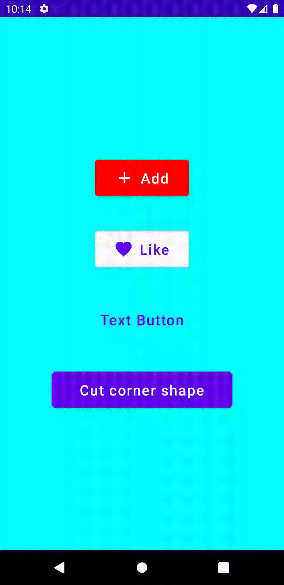
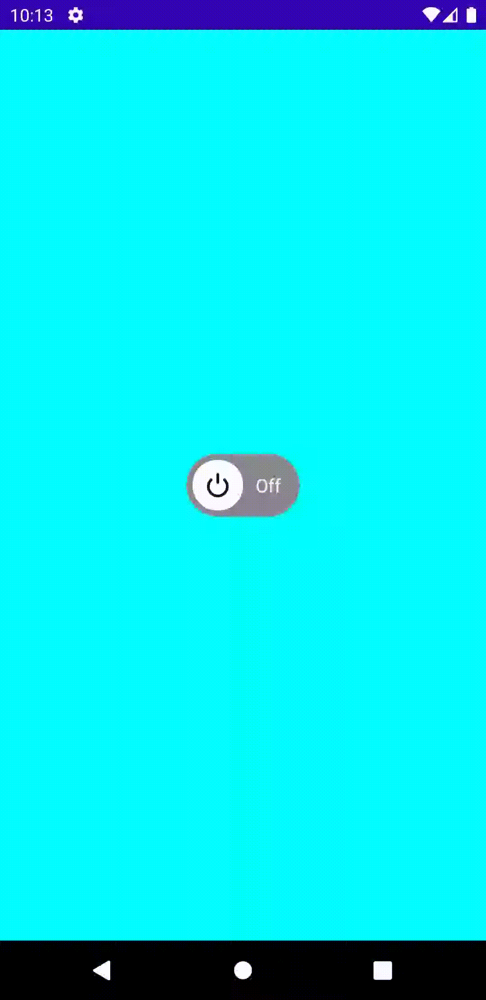
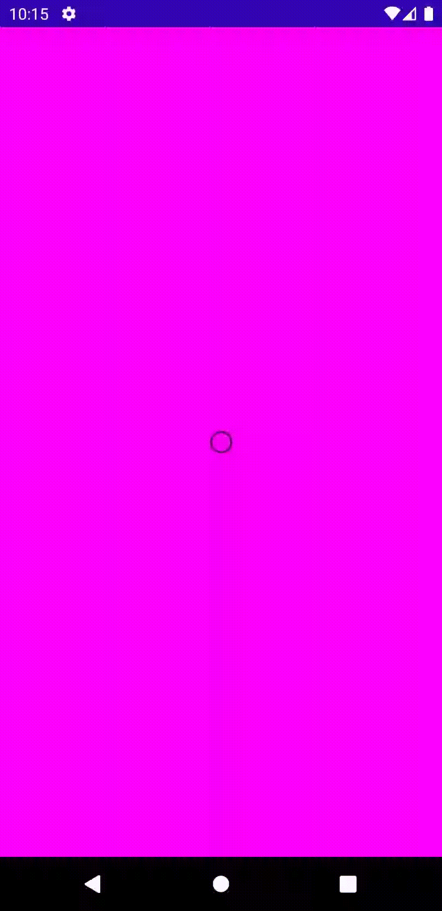

# Widget of The Day

</img>
Introduction to jetpack compose widgets: This repo will teach you some of the common widgets that are available in jetpack compose SDK, & shows you how to use them for your UI design. 
## Widgets List:

1. [Buttons](app/src/main/java/com/example/composewidgets/widgets/buttons/Buttons.kt) > Buttons, Radio Button, Toggle Button, Checkbox
2. [Expanded](/lib/2_expanded/expanded.dart) > flux > Toggle Button
3. [Column](/lib/3_column&row/column.dart) > Radio Button
4. [Row](/lib/3_column&row/column.dart) > Radio Button

5. [ListView](/lib/4_listview&builder/listview.dart) > Builder

## Screenshots:

<table align="center" style="margin: 0px auto;">
  <tr>
    <td>
        

            
            
<a href="app/src/main/java/com/example/composewidgets/widgets/buttons/Buttons.kt" target="_blank">Buttons</a>

        

    </td>
    <td>
        

            
            
<a href="app/src/main/java/com/example/composewidgets/widgets/buttons/CustomToggleButton.kt" target="_blank">Toggle Button</a>

        

    </td>
    <td>
        

            
            
<a href="app/src/main/java/com/example/composewidgets/widgets/buttons/RadioButton.kt" target="_blank">Radio Button</a>

        

    </td>
    <td>
        

            
            
<a href="/lib/3_column&row/row.dart" target="_blank">Row</a>

        

    </td>
    <td>
        

            
            
<a href="/lib/4_listview&builder/listview.dart" target="_blank">ListView & Builder</a>

        

    </td>
  </tr>
  <tr>
    <td>
        

            
            
<a href="/lib/5_single_child_scroll_view/single_child_scroll_view.dart" target="_blank">SingleChildScrollView</a>

        

    </td>
    <td>
        

            
            
<a href="/lib/6_image.asset/image_asset.dart" target="_blank">Image.asset</a>

        

    </td>
    <td>
        

            
            
<a href="/lib/7_gridview&builder/gridview.dart" target="_blank">GridViewBuilder</a>

        

    </td>
    <td>
        

            
            
<a href="/lib/8_gesturedetector/gesturedetector.dart" target="_blank">GestureDetector</a>

        

    </td>
    <td>
        

            
            
<a href="/lib/9_bottom-nav_bar/bottomnavbar.dart" target="_blank">BottomNavBar</a>

        

    </td>
  </tr>

</table>
