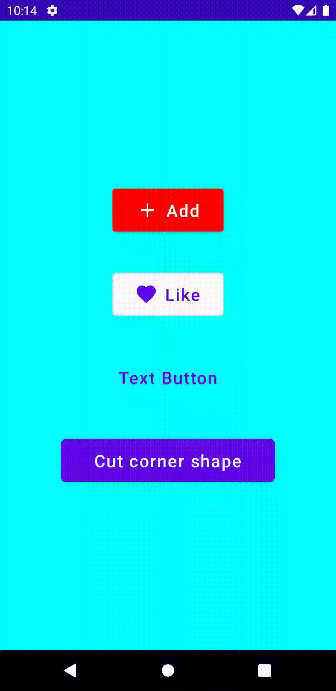
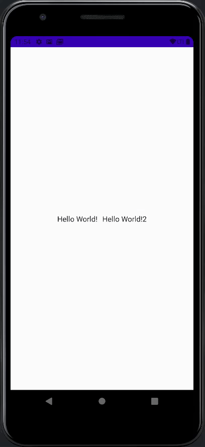
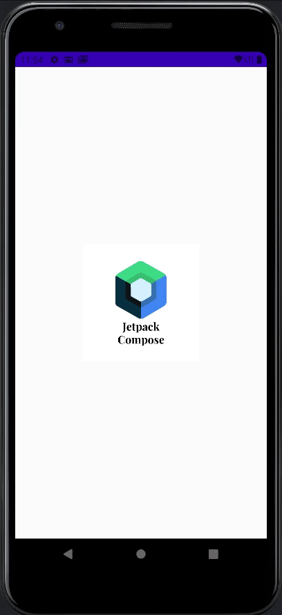
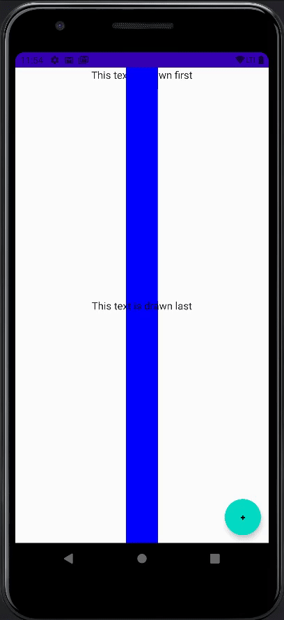
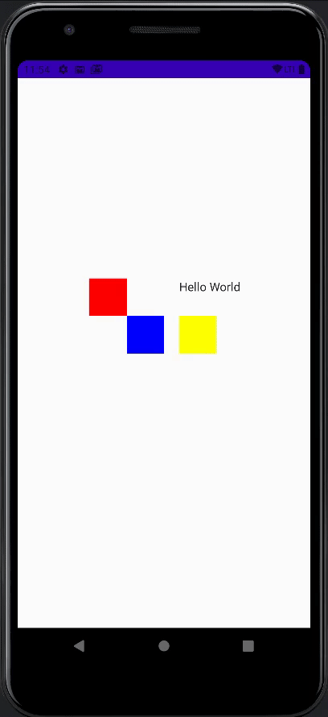
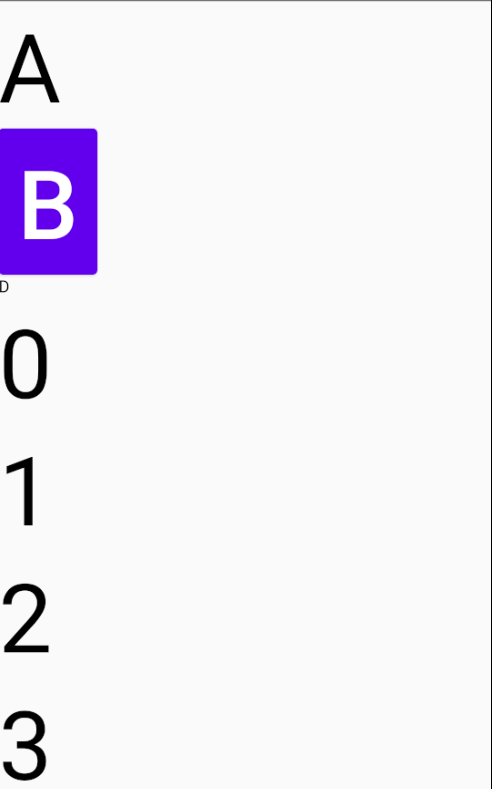
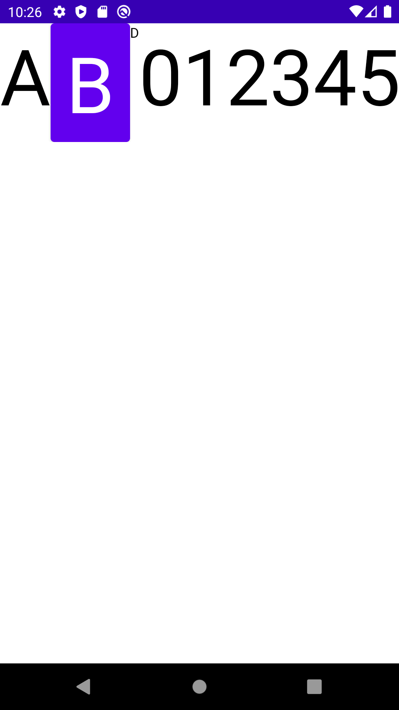
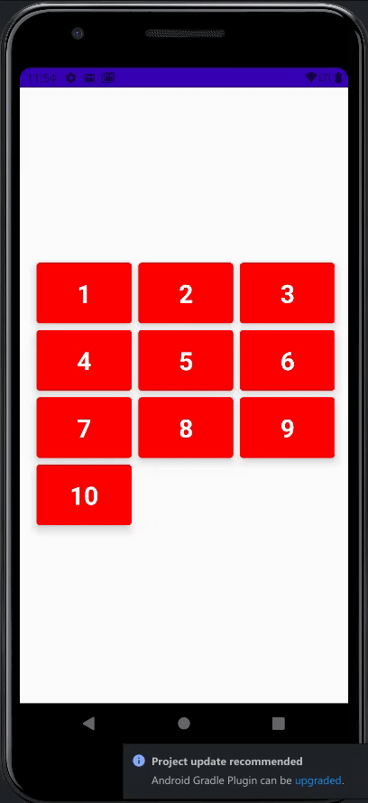

# Widget of The Day

</img>
Introduction to jetpack compose widgets: This repo will teach you some of the common widgets that are available in jetpack compose SDK, & shows you how to use them for your UI design. 
## Widgets List:

1. [Buttons](app/src/main/java/com/example/composewidgets/widgets/buttons/Buttons.kt) > [Radio Button](app/src/main/java/com/example/composewidgets/widgets/buttons/RadioButton.kt) > [Toggle Button](app/src/main/java/com/example/composewidgets/widgets/buttons/CustomToggleButton.kt)
2. [Column](app/src/main/java/com/example/composewidgets/widgets/column/ColumnExample.kt)
3. [Row](app/src/main/java/com/example/composewidgets/widgets/row/RowExample.kt)
4. [Image](app/src/main/java/com/example/composewidgets/widgets/image/ImageExample.kt)
5. [Box](app/src/main/java/com/example/composewidgets/widgets/box/BoxExample.kt)
6. [Constraint Layout](app/src/main/java/com/example/composewidgets/widgets/constraint_layout/ConstraintLayoutExample.kt)
7. [LazyColumn](app/src/main/java/com/example/composewidgets/widgets/lazy_column/LazyColumnExample.kt)
8. [LazyRow](app/src/main/java/com/example/composewidgets/widgets/lazy_row/LazyRowExample.kt)
9. [LazyVerticalGrid](app/src/main/java/com/example/composewidgets/widgets/lazy_vertical_grid/LazyVerticalGridExample.kt)

## Screenshots:

<table align="center" style="margin: 0px auto;">
  <tr>
    <td>
        

            
            
<a href="app/src/main/java/com/example/composewidgets/widgets/buttons/Buttons.kt" target="_blank">Buttons</a>

        

    </td>
    <td>
        

            
            
<a href="app/src/main/java/com/example/composewidgets/widgets/buttons/CustomToggleButton.kt" target="_blank">Toggle Button</a>

        

    </td>
    <td>
        

           
 
            
            
<a href="app/src/main/java/com/example/composewidgets/widgets/buttons/RadioButton.kt" target="_blank">Radio Button</a>

           

        

    </td>
   <td>
        

           
 
            
            
<a href="app/src/main/java/com/example/composewidgets/widgets/column/ColumnExample.kt" target="_blank">Column</a>

           

        

    </td>
     <td>
        

           
 
            
            
<a href="app/src/main/java/com/example/composewidgets/widgets/row/RowExample.kt" target="_blank">Row</a>

           

        

  </tr>
 <td>
        

           
 
            
            
<a href="app/src/main/java/com/example/composewidgets/widgets/image/ImageExample.kt" target="_blank">Image</a>

           

        

    </td>
    <td>
        

           
 
            
            
<a href="app/src/main/java/com/example/composewidgets/widgets/box/BoxExample.kt" target="_blank">Box</a>

           

        

    </td>  
     <td>
        

           
 
            
            
<a href="app/src/main/java/com/example/composewidgets/widgets/lazy_vertical_grid/LazyVerticalGridExample.kt" target="_blank">Constraint Layout</a>

           

        

    </td>  
     <td>
        

           
 
            
            
<a href="app/src/main/java/com/example/composewidgets/widgets/lazy_column/LazyColumnExample.kt" target="_blank">LazyColumn</a>

           

        

    </td>  
      <td>
        

           
 
            
            
<a href="app/src/main/java/com/example/composewidgets/widgets/lazy_row/LazyRowExample.kt" target="_blank">LazyRow</a>

           

        

    </td>  
 </tr>
 <td>
        

           
 
            
            
<a href="app/src/main/java/com/example/composewidgets/widgets/image/ImageExample.kt" target="_blank">LazyVerticalRow</a>

           

        

    </td>
   
    
    
</table>
