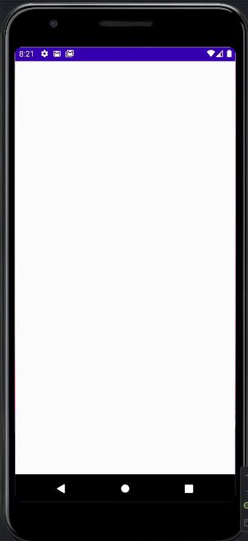

# Widget of The Day

</img>
Introduction to jetpack compose widgets: This repo will teach you some of the common widgets that are available in jetpack compose SDK, & shows you how to use them for your UI design. 

Some of the widgets are not yet available in the compose. I will update the repo as soon as they are available.
 
## Widgets List:

1. [Buttons](app/src/main/java/com/example/composewidgets/widgets/buttons/Buttons.kt)
2. [Radio Button](app/src/main/java/com/example/composewidgets/widgets/buttons/RadioButton.kt) 
3. [Toggle Button](app/src/main/java/com/example/composewidgets/widgets/buttons/CustomToggleButton.kt)
4. [Column](app/src/main/java/com/example/composewidgets/widgets/column/ColumnExample.kt)
5. [Row](app/src/main/java/com/example/composewidgets/widgets/row/RowExample.kt)
6. [Image](app/src/main/java/com/example/composewidgets/widgets/image/ImageExample.kt)
7. [Box](app/src/main/java/com/example/composewidgets/widgets/box/BoxExample.kt)
8. [Constraint Layout](app/src/main/java/com/example/composewidgets/widgets/constraint_layout/ConstraintLayoutExample.kt)
9. [LazyColumn](app/src/main/java/com/example/composewidgets/widgets/lazy_column/LazyColumnExample.kt)
10. [LazyRow](app/src/main/java/com/example/composewidgets/widgets/lazy_row/LazyRowExample.kt)
11. [LazyVerticalGrid](app/src/main/java/com/example/composewidgets/widgets/lazy_vertical_grid/LazyVerticalGridExample.kt)
12. [Chip](app/src/main/java/com/example/composewidgets/widgets/chips/ChipExample.kt)
13. [Slider](app/src/main/java/com/example/composewidgets/widgets/slider/SliderExample.kt)
14. [CircularProgressIndicator](app/src/main/java/com/example/composewidgets/widgets/circularprogress/CircularProgressIndicatorExample.kt)
15. [Dropdown](app/src/main/java/com/example/composewidgets/widgets/dropdown/DropDownExample.kt)
16. [ModalBottomSheet](app/src/main/java/com/example/composewidgets/widgets/modalbottomsheetlayout/ModalBottomSheetLayout.kt)
17. [SnackBar](app/src/main/java/com/example/composewidgets/widgets/snackbar/SnackBarExample.kt)
18. [TopAppBar](app/src/main/java/com/example/composewidgets/widgets/topappbar/TopAppBarExample.kt)
19. [TextField](app/src/main/java/com/example/composewidgets/widgets/textfield/TextFieldExample.kt)
20. [BadgeBox](app/src/main/java/com/example/composewidgets/widgets/badgebox/BadgeBoxExample.kt)

## Screenshots:

<table align="center" style="margin: 0px auto;">
  <tr>
    <td>
        

            
            
<a href="app/src/main/java/com/example/composewidgets/widgets/buttons/Buttons.kt" target="_blank">Buttons</a>

        

    </td>
    <td>
        

            
            
<a href="app/src/main/java/com/example/composewidgets/widgets/buttons/CustomToggleButton.kt" target="_blank">Toggle Button</a>

        

    </td>
    <td>
        

           
 
            
            
<a href="app/src/main/java/com/example/composewidgets/widgets/buttons/RadioButton.kt" target="_blank">Radio Button</a>

           

        

    </td>
   <td>
        

           
 
            
            
<a href="app/src/main/java/com/example/composewidgets/widgets/column/ColumnExample.kt" target="_blank">Column</a>

           

        

    </td>
     <td>
        

           
 
            
            
<a href="app/src/main/java/com/example/composewidgets/widgets/row/RowExample.kt" target="_blank">Row</a>

           

        

  </tr>
 <td>
        

           
 
            
            
<a href="app/src/main/java/com/example/composewidgets/widgets/image/ImageExample.kt" target="_blank">Image</a>

           

        

    </td>
    <td>
        

           
 
            
            
<a href="app/src/main/java/com/example/composewidgets/widgets/box/BoxExample.kt" target="_blank">Box</a>

           

        

    </td>  
     <td>
        

           
 
            
            
<a href="app/src/main/java/com/example/composewidgets/widgets/lazy_vertical_grid/LazyVerticalGridExample.kt" target="_blank">Constraint Layout</a>

           

        

    </td>  
     <td>
        

           
 
            
            
<a href="app/src/main/java/com/example/composewidgets/widgets/lazy_column/LazyColumnExample.kt" target="_blank">LazyColumn</a>

           

        

    </td>  
      <td>
        

           
 
            
            
<a href="app/src/main/java/com/example/composewidgets/widgets/lazy_row/LazyRowExample.kt" target="_blank">LazyRow</a>

           

        

    </td>  
 </tr>
 <td>
        

           
 
            
            
<a href="app/src/main/java/com/example/composewidgets/widgets/image/ImageExample.kt" target="_blank">LazyVerticalRow</a>

           

        

         <td>
        

           
 
            
            
<a href="app/src/main/java/com/example/composewidgets/widgets/chips/ChipExample.kt" target="_blank">Chip</a>

           

        

    </td>
     <td>
        

           
 
            
            
<a href="app/src/main/java/com/example/composewidgets/widgets/slider/SliderExample.kt" target="_blank">Slider</a>

           

        

    </td>
    <td>
        

           
 
            
            
<a href="app/src/main/java/com/example/composewidgets/widgets/circularprogress/CircularProgressIndicatorExample.kt" target="_blank">CircularProgressIndicator</a>

           

        

    </td>
   <td>
        

           
 
            
            
<a href="app/src/main/java/com/example/composewidgets/widgets/dropdown/DropDownExample.kt" target="_blank">Dropdown</a>

           

        

    </td>
    
</tr>
<td>
        

           
 
            
            
<a href="app/src/main/java/com/example/composewidgets/widgets/modalbottomsheetlayout/ModalBottomSheetLayout.kt" target="_blank">ModalBottomSheet</a>

           

        

         <td>
        

           
 
            
            
<a href="app/src/main/java/com/example/composewidgets/widgets/snackbar/SnackBarExample.kt" target="_blank">SnackBar</a>

           

        

    </td>
     <td>
        

           
 
            
            
<a href="app/src/main/java/com/example/composewidgets/widgets/topappbar/TopAppBarExample.kt" target="_blank">TopAppBar</a>

           

        

    </td>
    <td>
        

           
 
            
            
<a href="app/src/main/java/com/example/composewidgets/widgets/textfield/TextFieldExample.kt" target="_blank">TextField</a>

           

        

    </td>
   <td>
        

           
 
            
            
<a href="app/src/main/java/com/example/composewidgets/widgets/badgebox/BadgeBoxExample.kt" target="_blank">BadgeBox</a>

           

        

    </td>
</table>

### Need Help?

If you need help in setting up the project or have any questions, feel free to reach out to me on [Twitter](https://twitter.com/tusharhow) or [LinkedIn](https://www.linkedin.com/in/tusharhow/)

### Social Media

